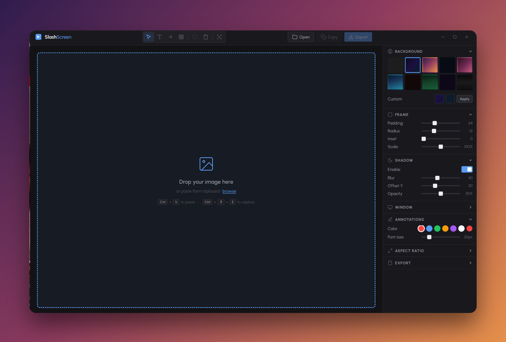
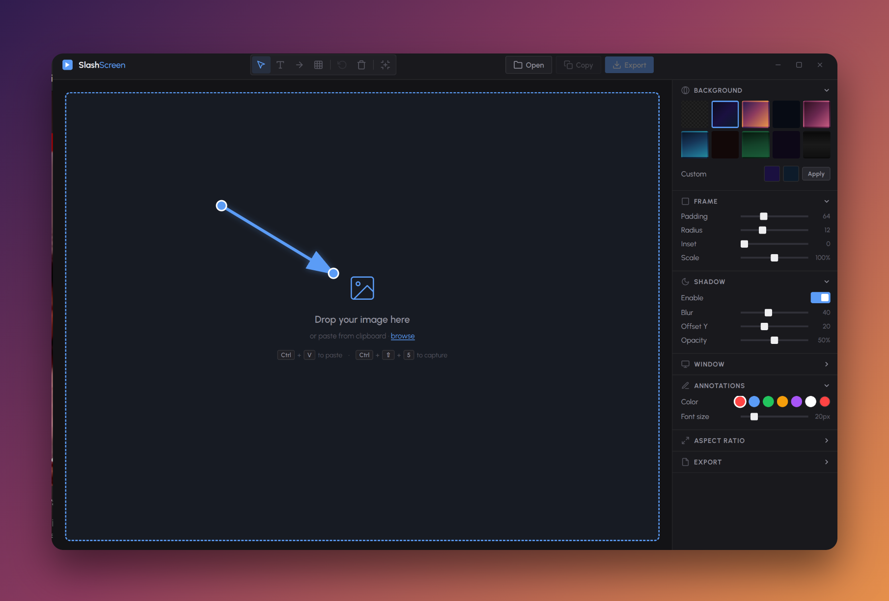

  

<h1 align="center">Slashscreen</h1>

  <strong>Make your screenshots gorgeous.</strong> 
  A fast, native desktop app that turns raw screenshots into polished visuals — in seconds.

  <a href="https://slashscreen.app">Website</a> &nbsp;&middot;&nbsp;
  <a href="https://github.com/slashbinslashnoname/Slash-screen/releases">Downloads</a>

  
  
  

---

  

## What is Slashscreen?

Slashscreen is a screenshot beautifier for people who care about presentation. Drop in a screenshot, pick a background, tweak the frame, add annotations — and export a pixel-perfect image ready for docs, tweets, decks, or app store listings.

No browser tab. No account. No subscription. Just a native app that runs on your machine.

---

## Features

### Backgrounds

10 handcrafted gradients and mesh backgrounds — or go transparent for full control.

> Midnight, Sunset, Aurora, Rose, Ocean, Ember, Forest, Lavender, Noir

### Frame controls

- Adjustable **padding**, **border radius**, and **inset**
- Optional **drop shadow** with tunable blur
- **Window chrome** toggle — adds macOS-style traffic lights for that native feel

### Annotations

| Tool | What it does |
|------|-------------|
| **Text** | Click to place, double-click to edit. Custom color & size. |
| **Arrow** | Drag to draw. Reposition endpoints freely. |
| **Redact** | Draw a box to blur or cover sensitive content. |

### Export

- **PNG export** at 1x, 2x, or 3x scale
- **Copy to clipboard** — paste straight into Slack, Notion, or anywhere
- **Device presets** — export at exact iPhone or iPad dimensions for App Store screenshots

### Aspect ratios

Lock your canvas to **16:9**, **4:3**, **1:1**, or device-specific presets (iPhone, iPad).

### Canvas navigation

Scroll to zoom. Space + drag to pan. Standard shortcuts for zoom in/out/reset.

---

  

---

## Keyboard shortcuts

| Shortcut | Action |
|----------|--------|
| `V` | Select tool |
| `T` | Text tool |
| `A` | Arrow tool |
| `R` | Redact tool |
| `Ctrl/Cmd + O` | Open file |
| `Ctrl/Cmd + S` | Export |
| `Ctrl/Cmd + Shift + C` | Copy to clipboard |
| `Ctrl/Cmd + Z` | Undo |
| `Ctrl/Cmd + Shift + 2` | Capture screen area |
| `Delete` | Remove selected annotation |
| `Ctrl/Cmd + 0` | Reset zoom |
| `Ctrl/Cmd + =` | Zoom in |
| `Ctrl/Cmd + -` | Zoom out |

---

## Download

Grab the latest release for your platform:

| Platform | Format |
|----------|--------|
| **macOS** | `.zip` |
| **Windows** | `.exe` (installer) / portable |
| **Linux** | `.AppImage` / `.deb` |

**[Download the latest release &rarr;](https://github.com/slashbinslashnoname/Slash-screen/releases)**

---

  

---

## Pricing

**$9 — once, forever.** No subscription. No account required. Pay once, use it on all your machines.

Lost your license? Restore it anytime with the email you used at checkout.

---

## Built with

- [Electron](https://www.electronjs.org/) — cross-platform desktop runtime
- [React](https://react.dev/) — UI framework
- [Vite](https://vite.dev/) — build tooling
- [html-to-image](https://github.com/bubkoo/html-to-image) — canvas export
- [Stripe](https://stripe.com/) — payments

---

  Made by <a href="https://github.com/slashbinslashnoname">@slashbinslashnoname</a>

